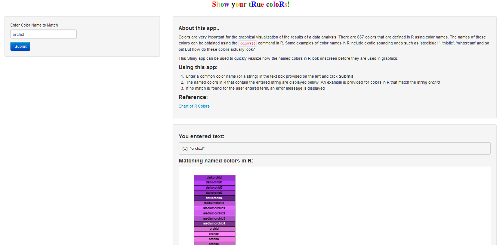

Show R colors Shiny App
========================================================
author: Jyothi Subramanian
date: August 23, 2014
transition: linear
font-family: 'Helvetica'

Motivation
========================================================

  
- Colors are very important for the graphical visualization of the results of a data analysis
- There are 657 colors that are defined in R using color names
-- <small>Obtained using the colors() command in R</small>

```r
head(colors(), n=4)
```

```
[1] "white"         "aliceblue"     "antiquewhite"  "antiquewhite1"
```
- Some of these color names in R include exotic sounding ones such as 'steelblue1', 'thistle', 'mintcream' and so on! But how do these colors actually look? 
- This 'Show R colors' Shiny app can be used to quickly visulize how the named colors in R look onscreen 


How to use this app?
========================================================

- Very simple to use - just enter a common color name (or a string) in the text box provided and click "Submit""
 - The named colors in R that contain the entered string are displayed 
  - If no match is found for the user entered term, an error message is displayed 
  
Screenshot
========================================================



Adding more features to the app
==================
type: section
- This is version 1 of the 'Show R colors' Shiny app
- Successive versions of this app can have the following features included:
- <small> To display the color given an RGB triad or a hexadecimal representation </small>
- <small> Display color pallettes like heat.colors(), rainbow() and so on...</small>


Thank You!
